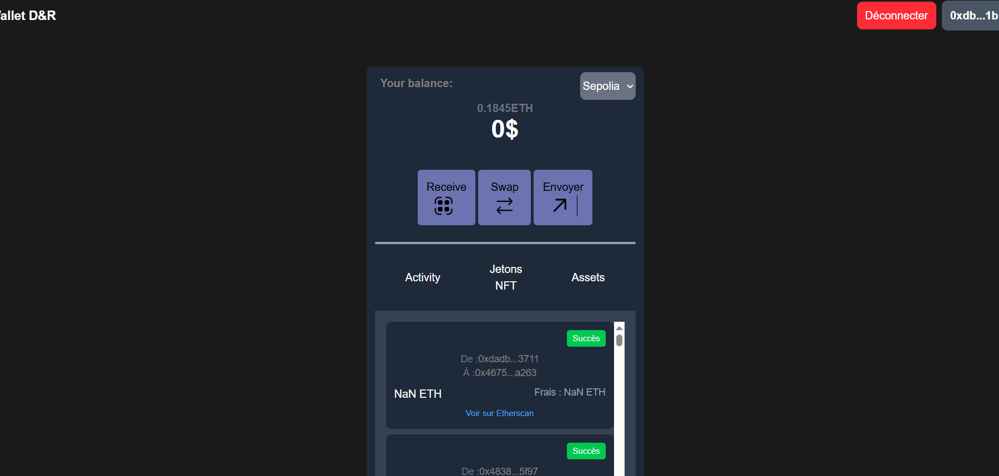

# MyWallet    

## Description

MyWallet D&R is a React web application that allows you to manage an Ethereum wallet.
It lets you connect your wallet, view your balance, receive funds via QR code, send ETH, and perform simple token swaps.

## Fonctionnalités

- Connect / disconnect wallet 🔐
- Display ETH balance 🌐
- Generate a QR code to receive funds 💰
- Send ETH to a specific address ✔️
- Simple token swaps (WETH, USDC) 🔁
- Switch networks (Sepolia, Mainnet) ⚡

## Installation

1. Clone the repository

git clone

2. Install dependencies

npm install

3. Run the app locally

npm run dev

## Introduction

MyWallet is a dapp applications where you can sends funds, swap tokens in ethereum blockhain. I made a couple features to switch to mainnet and testnet via chain ID and more.
This applications was made with the framework react and a plugin-vite and tailwindcss for the frontend interfaces. 

## Features

- Ability to switch between Ethereum Mainnet and popular testnets (Sepolia) directly from the interface.
Detection of current chain via window.ethereum.chainId and dynamic chainChanged handling.

- Swapping ETH to USDC using the Uniswap SDK (@uniswap/sdk-core, @uniswap/v3-sdk).

- TH transfers to any valid Ethereum address using ethers.js with notifications and tx-hash.

- Fully responsive frontend using Tailwind CSS.

- Connect your wallet with `window.ethereum.request({ method: 'eth_requestAccounts' })`.

  

