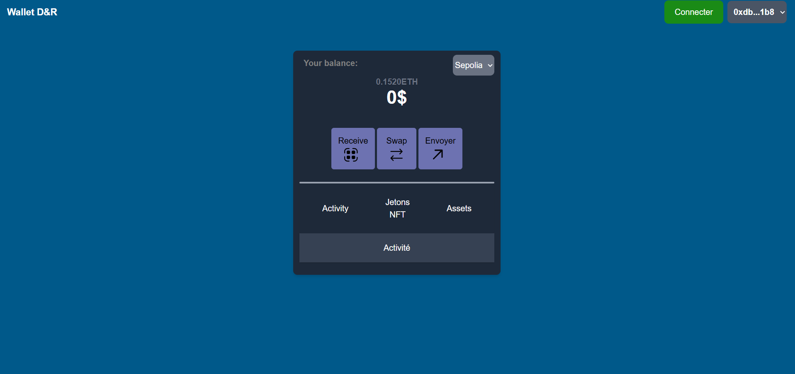

# MyWallet    

## Description

MyWallet D&R is a React web application that allows you to manage an Ethereum wallet.
It lets you connect your wallet, view your balance, receive funds via QR code, send ETH, and perform simple token swaps.


## Fonctionnalités

- Connect / disconnect wallet 🔐
- Display ETH balance 🌐
- Generate a QR code to receive funds 💰
- Send ETH to a specific address ✔️
- Simple token swaps (WETH, USDC) 🔁
- Switch networks (Sepolia, Mainnet) ⚡



## Installation

1. Clone the repository
```bash
git clone <git@github.com:OfOluo/mywallet.git>

2. Install dependencies
```bash
npm install

3. Run the app locally
```bash
npm run dev


